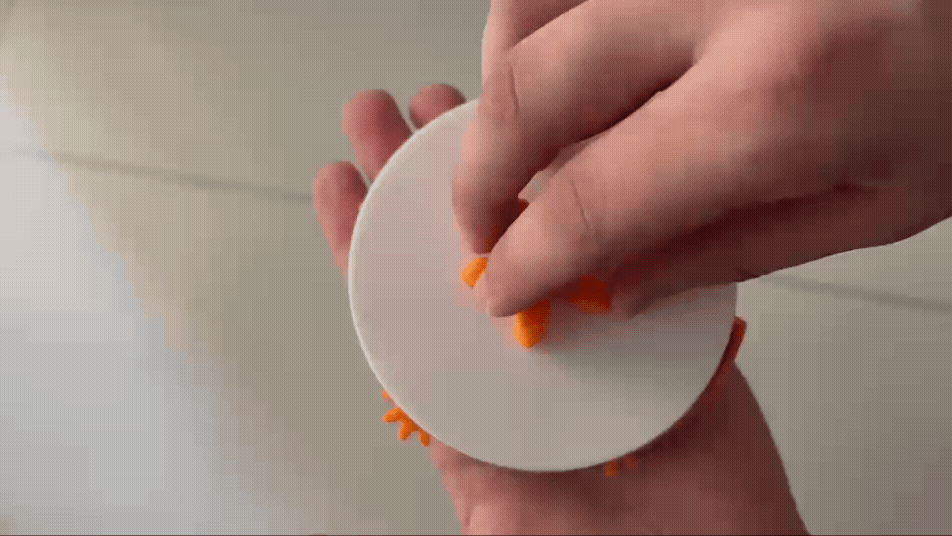
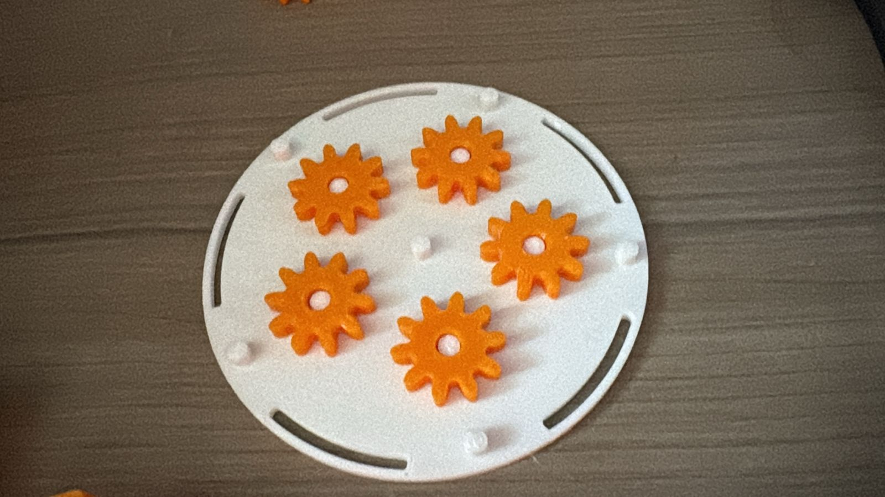
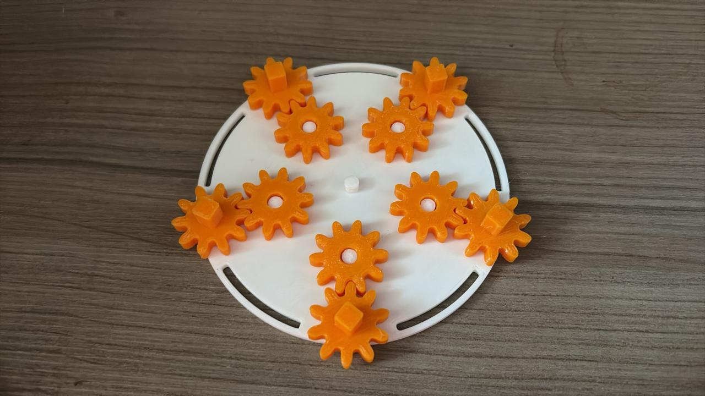
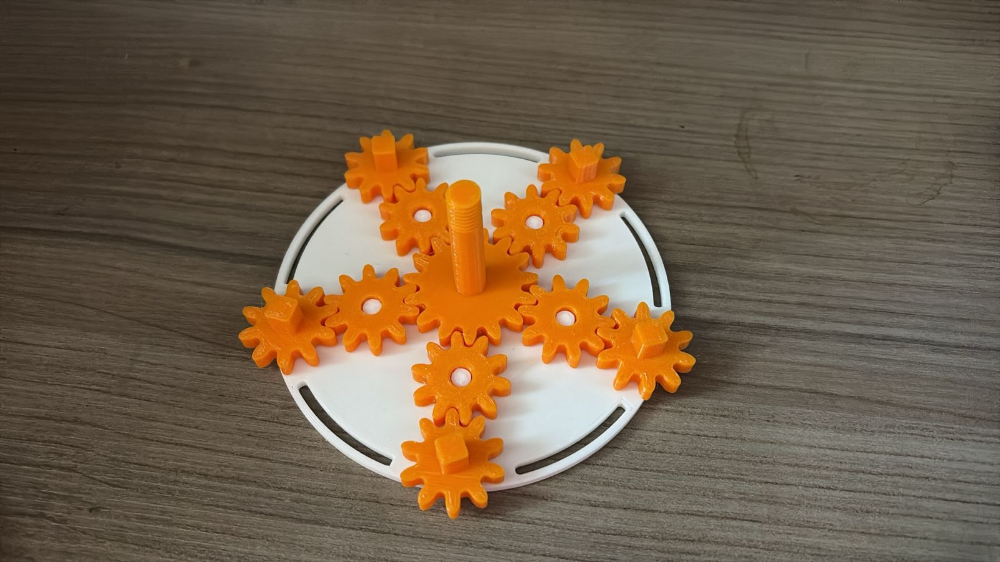
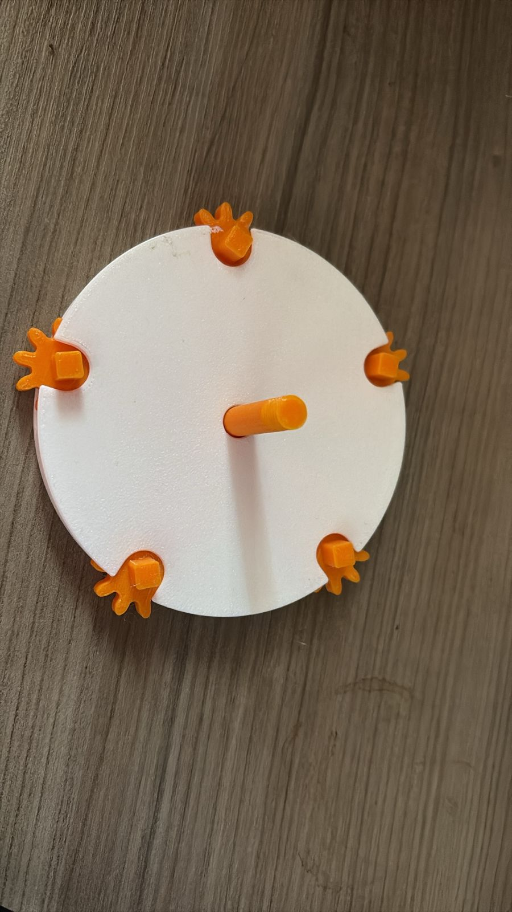
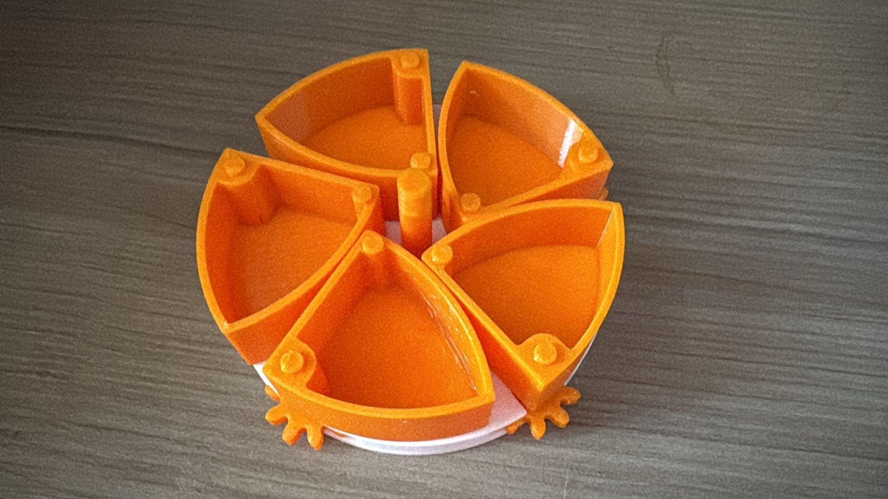
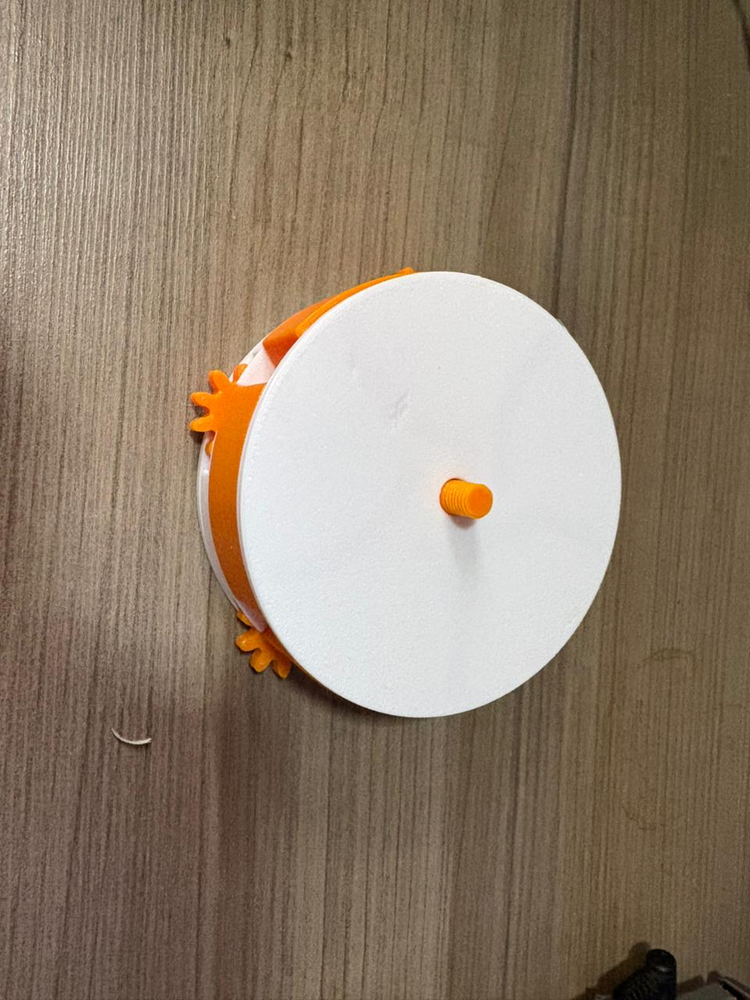
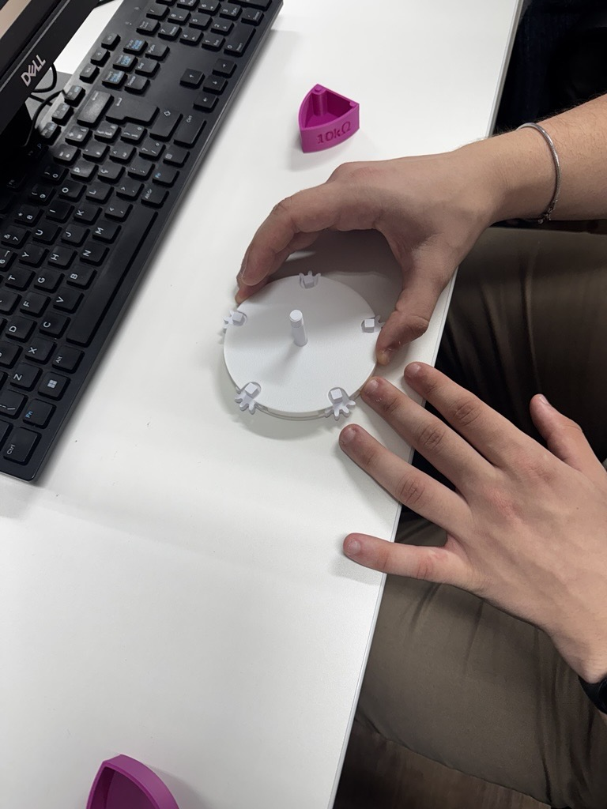

# 📦 Projeto – Montagem de Caixa | CP2

## 📌 Descrição
Este projeto tem como objetivo a montagem e análise de um conjunto mecânico composto por engrenagens e componentes móveis, permitindo compreender seu funcionamento na prática.

Além da montagem, foram realizadas medições com paquímetro das principais peças e modelagem 3D de um componente do sistema.

---

## 🎯 Objetivos do Projeto
- Montar corretamente o sistema mecânico da caixa  
- Entender o funcionamento das engrenagens  
- Medir componentes utilizando paquímetro  
- Documentar o processo de montagem  
- Modelar uma peça em 3D  

---

## 🧩 Componentes Recebidos

- 2x Base inferior da caixa  
- 1x Tampa  
- 10x Engrenagens  
- 2x Eixos e encaixes  
- 5x Componentes móveis  

---

## 📏 Medidas das Peças

### ⚙️ Engrenagem Simples
- Diâmetro: 21 mm  
- Altura: 6 mm  
- Distância entre dentes: 3 mm  

### ⚙️ Engrenagem com Eixo (Engrenagem Alta)
- Diâmetro da engrenagem: 33 mm  
- Altura da engrenagem: 4 mm  
- Altura total: 39 mm  
- Diâmetro do eixo: 6 mm  
- Altura da rosca: 8 mm  

### 📦 Base Inferior (Caixa)
- Comprimento: 44.4 mm  
- Largura: 41.6 mm  
- Altura: 21.1 mm  

### ⚪ Disco Base (sem pinos)
- Diâmetro: 100 mm  
- Altura: 9 mm  
- Distância entre encaixes: 27 mm  

### ⚪ Disco com Pinos
- Diâmetro: 97 mm  
- Altura sem pino: 2 mm  
- Altura com pino: 5 mm  
- Diâmetro dos pinos: 3 mm  

### ⚪ Disco Superior (com furos e eixo central)
- Diâmetro: 97.1 mm  
- Altura: 1.5 mm  
- Diâmetro do eixo central: 6 mm  

**Furações:**
- Furo maior:
  - Abertura: 4 mm  
  - Comprimento: 41 mm  

- Furo menor:
  - Diâmetro: 3 mm  

**Distâncias:**
- Entre furos maiores (base): 53 mm  
- Entre furos maiores (extremidades): 14 mm  

---

## 🛠️ Passo a Passo da Montagem

### 🔹 Passo 1 – Posicionamento das Engrenagens
Colocar as engrenagens simples nos nos 5 pinos da base.

---

### 🔹 Passo 2 – Preparação da Base
Colocar as engrenagens de ponta quadrada nos encaixes laterais da base.

---

### 🔹 Passo 3 – Inserção da Engrenagem Central
Adicionar a engrenagem com eixo no centro da estrutura.

---

### 🔹 Passo 4 – Montagem dos Componentes Móveis
Adicionar a tampa formando o mecanismo interno.

### 🔹 Passo 5 – Montagem dos Componentes Móveis
Encaixar os componentes móveis formando o mecanismo interno.

---

### 🔹 Passo 6 – Fechamento com Disco Superior
Posicionar o disco superior alinhando os encaixes.

 

---

### 🔹 Passo 7 – Fixação Final
rosqueie o encaixe superior até fixar completamente.

 

---

## ⚠️ Observações Importantes

- Foi necessário **lixar levemente as pontas das engrenagens**, pois inicialmente estavam com dificuldade para girar corretamente.  
- Durante a montagem, é importante ter **cuidado ao aplicar força no encaixe superior**, pois o excesso de pressão pode causar quebra da peça.  

---

## ⚙️ Funcionamento do Sistema
O mecanismo funciona através da transmissão de movimento entre as engrenagens. Ao girar o eixo central, as engrenagens laterais são acionadas, movimentando os componentes internos de forma sincronizada.

---

## 🧱 Modelagem 3D
Uma das peças do conjunto foi modelada em 3D utilizando software CAD.

📁 [Engrenagem](./engrenagem-cp2.scad)

---

## 📸 Registro da Montagem
 
 
 
 

---

## 👨‍💻 Integrantes
| Nome                                | RM       |
|-------------------------------------|----------|
| 🍙 Fernanda Kaory Saito             | RM551104 |
| ⚡ João Pedro Borsato Cruz          | RM550294 |
| 💫 Maria Fernanda Vieira de Camargo | RM97956  |
| 🚀 Pedro Lucas de Andrade Nunes     | RM550366 |

